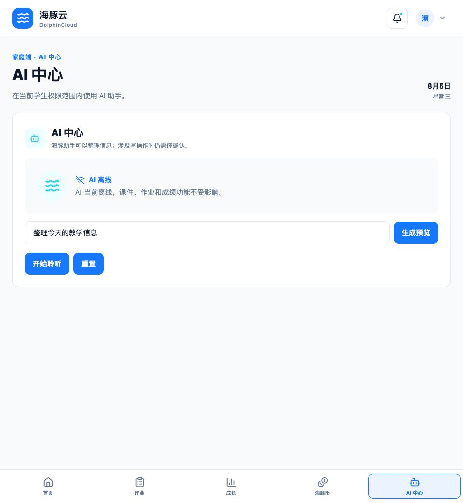

# 海豚云 · DolphinCloud

> 面向校园日常协作的 AI 平台，让教学、成长评价、激励与自治在同一个可信空间中完成。

- 🏆 **AIY 黑客松 2026 深圳站**参赛作品
- 🏷 **命题企业 / 赛道：** Coze · 校园生活 AI 助手
- 👥 **团队：** Team Falcons
- 🔢 **团队编号：** MD0037



## 👥 团队分工

| 成员 | GitHub | 负责内容 |
| --- | --- | --- |
| Haoyu Huang | [@HY916-cn](https://github.com/HY916-cn) | 产品设计、架构协调、代码审查、测试构建与路演 |
| Qiteng Jiang | [@cskunkuncskk](https://github.com/cskunkuncskk) | Web 前端、六角色工作台、教学与成绩体验 |
| Lilun Yan | [@Simen111216](https://github.com/Simen111216) | Supabase、治理账本、权限安全与发布工程 |

## ✨ 它能做什么

- **六角色协作：** 教师端、班级端、家庭端、银行端、自治会端和管理端共享同一套业务事实，同时保持权限隔离。
- **教学闭环：** 教师向班级发送课件、发布作业与成绩单；家庭端只能查看绑定学生的数据。
- **三套独立体系：** 学生分、班级分和海豚币分别授权、分别记账，不互相混算。
- **治理可追溯：** 支持罚款、班级排行、操作审计及指定历史操作撤销。
- **AI 中心：** 通过服务端网关接入 Coze，结合当前角色和范围整理信息；写操作先生成确认草稿，用户确认后才调用海豚云服务。
- **今日摘要：** 汇总当前角色真正有权查看的课件、作业、成绩与治理动态。

## 🎬 演示

建议按以下路线体验核心闭环：

1. 教师端发布作业或成绩单，并完成一次学生加分。
2. 班级端查看班级表现和排行。
3. 家庭端验证只能查看绑定学生的成绩与成长记录。
4. 银行端创建罚款并执行指定撤销；自治会端查看班级分。
5. AI 中心查询今日摘要，并观察写操作的确认流程。

> 在线体验地址将在完成公网 HTTPS 部署后补充。仓库不提供真实学生数据、演示账号密码或服务端密钥。

## 🛠 技术与 AI 工具

| 层级 | 技术 |
| --- | --- |
| Web 客户端 | React Native、Expo Router、TypeScript |
| 身份与数据 | Supabase Auth、PostgreSQL、RLS、RPC、Storage |
| AI 运行时 | Coze，经海豚云服务端 AI Gateway 受控接入 |
| 质量保障 | Vitest、pgTAP、ESLint、GitHub Actions、Gitleaks |
| 协作开发 | Git、GitHub、Codex |

Coze 仅作为产品运行时 AI 服务。客户端不保存 Coze Token，AI 不可用时课件、作业、成绩和治理功能仍可使用；任何 AI 写操作都不能绕过角色权限和用户确认。

## 🚀 怎么跑起来

环境要求：Node.js 22.13 或更高版本、pnpm 11.9。

```bash
pnpm install --frozen-lockfile
cp apps/client/.env.example apps/client/.env
pnpm web
```

浏览器打开终端输出的本地地址。连接真实服务前，请在 `apps/client/.env` 配置自己的 Supabase 公共地址与匿名密钥；Coze Token 等服务端机密只能配置在部署平台的 Secret 中，不能写入仓库。

提交前运行完整 Web 质量门禁：

```bash
pnpm verify:deps
pnpm format:check
pnpm lint
pnpm typecheck
pnpm test
pnpm database:test
pnpm smoke:web
```

更详细的工程入口见 [START_HERE.md](./START_HERE.md)，架构、权限和协作规范位于 [docs](./docs)。

## 🔐 安全与隐私

- 认证身份来自 Supabase JWT，客户端声明的角色和用户 ID 不作为授权依据。
- 成绩、学生分、班级分、海豚币、罚款和文件均受角色范围及 RLS 约束。
- 写操作具备服务端授权、幂等控制和审计；指定撤销生成新的补偿记录，不修改历史流水。
- `.env`、Token、密码、真实学生信息和命题企业私有数据禁止提交。
- GitHub Actions 对仓库完整历史执行 Secret scan。

如发现安全问题，请不要在公开 Issue 中粘贴凭据或个人信息，改用仓库维护者提供的私密联系方式报告。

## 📌 后续计划

- 完成公网 HTTPS Web 部署与可公开访问的体验入口。
- 接入赛事提供的 Coze 资源，完成真实 AI 网关联调。
- 增加关键业务路径的浏览器端自动化回归。
- 持续改善无障碍、移动端排版和低网速体验。

## 📄 版权与许可

本作品版权归 **Haoyu Huang、Lilun Yan、Qiteng Jiang** 共同所有，采用 [MIT License](./LICENSE) 开源，使用请署名。

> 本项目为 AIY 黑客松参赛作品，作品归团队所有；AIY 组委会仅作收录与展示。
