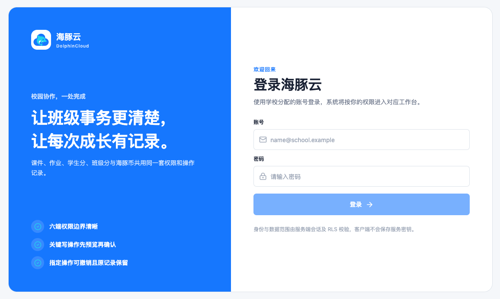
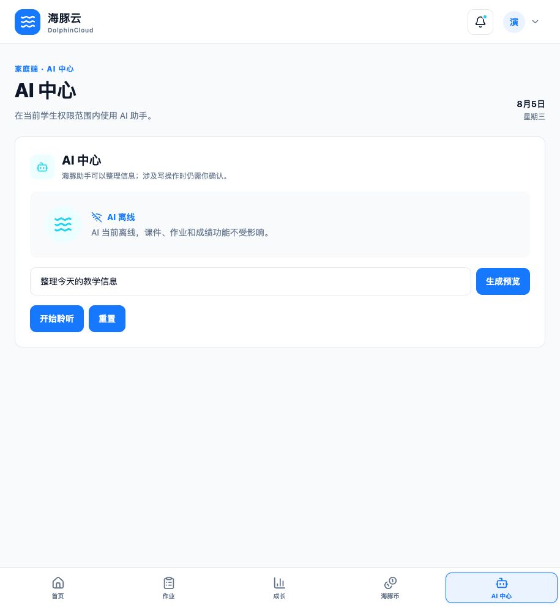

# 海豚云 DolphinCloud

**AIY 黑客松 2026 深圳站 · Coze AI 赛道金奖 · 全场 TOP 2**

海豚云是一套面向校园日常协作的 AI 平台。我们把课件、作业、成绩、成长评价、班级治理和校园激励放进同一套系统，让教师、学生、家庭和校园管理者基于同一份数据协作，同时保持清晰的权限边界。

本项目由 Team Falcons（MD0037）开发。



## 核心功能

- **六类角色工作台**：教师端、班级端、家庭端、银行端、自治会端和管理端各自拥有独立入口与权限。
- **教学协作**：教师可以发送课件、发布作业和成绩单；班级端接收教学信息，家庭端查看绑定学生的数据。
- **三套独立计分体系**：学生分、班级分和海豚币分别授权、分别记账，避免不同用途的数据混在一起。
- **校园治理**：支持班级排行、罚款、操作审计和指定记录撤销，重要操作都有迹可循。
- **AI 中心**：根据当前用户的角色和权限整理信息；涉及写入时，先生成操作草稿，再由用户确认执行。
- **今日摘要**：集中展示当前角色可以查看的课件、作业、成绩和治理动态。



## 产品设计

海豚云不是六套彼此割裂的后台。不同角色共享同一套业务数据，但每个人只能看到和处理自己职责范围内的内容。

项目中的学生分、班级分、海豚币和成绩是四类独立数据。学生分不会自动兑换海豚币，班级分不会分摊给个人，成绩也不会计入学生分。涉及分值和海豚币的变更采用不可变流水；撤销操作通过新增反向记录完成，不直接改写历史。

AI 负责理解意图、整理信息和生成回复，不直接访问数据库，也不能绕过用户确认执行写操作。即使 AI 服务暂时不可用，课件、作业、成绩和校园治理等基础功能仍然可以正常使用。

## 使用场景

一条典型的使用流程如下：

1. 在教师端切换授权班级，发送课件、发布作业与成绩单，并记录学生分。
2. 在班级端查看课件、作业、学生分排行和班级表现。
3. 在家庭端查看绑定学生的成绩、成长记录和海豚币信息。
4. 在自治会端查看班级分，在银行端处理罚款并撤销指定记录。
5. 在 AI 中心查询当前权限范围内的信息，并体验“生成草稿—人工确认—执行操作”的流程。

## 技术栈

| 模块 | 技术 |
| --- | --- |
| 客户端 | React Native、Expo Router、TypeScript |
| 身份与数据 | Supabase Auth、PostgreSQL、RLS、RPC、Storage |
| AI 运行时 | DeepSeek、海豚云服务端 AI Gateway |
| 质量保障 | Vitest、pgTAP、ESLint、GitHub Actions、Gitleaks |

在方案设计阶段，我们使用 Coze 的 Agent、Skill 和 Workflow 能力拆解校园场景，重点验证了“自然语言意图—操作草稿—人工确认”这条交互链路。产品运行时通过海豚云服务端 AI Gateway 调用 DeepSeek。

## 项目结构

```text
apps/client/    Expo 客户端与六类角色工作台
packages/       公共类型、业务逻辑和数据库测试
supabase/       数据库迁移与 Edge Functions
docs/           架构、权限和产品规范
scripts/        测试、构建与发布脚本
```

## 本地运行

环境要求：Node.js 22.13 或更高版本、pnpm 11.9。

```bash
pnpm install --frozen-lockfile
cp apps/client/.env.example apps/client/.env
pnpm web
```

浏览器打开终端输出的本地地址即可。连接自己的 Supabase 项目前，需要在 `apps/client/.env` 中配置公共地址和匿名密钥。`DEEPSEEK_API_KEY` 等服务端密钥只能保存在部署平台的 Secret 中，不能写入仓库或客户端环境变量。

完整质量检查：

```bash
pnpm verify:deps
pnpm format:check
pnpm lint
pnpm typecheck
pnpm test
pnpm database:test
pnpm smoke:web
```

架构、权限和产品规范位于 [docs](./docs)。

## 安全与隐私

- 用户身份来自 Supabase JWT，客户端提交的角色和用户 ID 不作为授权依据。
- 成绩、学生分、班级分、海豚币、罚款和文件均受角色范围及 RLS 约束。
- 写操作在服务端完成授权、幂等和审计校验；撤销会生成补偿记录，不修改历史流水。
- `.env`、Token、密码、真实学生信息和企业私有数据不得提交到仓库。
- GitHub Actions 会对仓库完整历史执行 Secret Scan。

如果发现安全问题，请不要在公开 Issue 中粘贴凭据或个人信息，请通过仓库维护者提供的私密联系方式报告。

## 团队

| 成员 | GitHub | 负责内容 |
| --- | --- | --- |
| Haoyu Huang | [@HY916-cn](https://github.com/HY916-cn) | 产品设计、架构协调、代码审查与质量保障 |
| Lilun Yan | [@Simen111216](https://github.com/Simen111216) | Supabase、治理账本、权限安全与发布工程 |
| Qiteng Jiang | [@cskunkuncskk](https://github.com/cskunkuncskk) | Web 前端、六角色工作台、教学与成绩体验 |

## 许可

本作品版权归 Haoyu Huang、Lilun Yan、Qiteng Jiang 共同所有，采用 [MIT License](./LICENSE) 开源。
