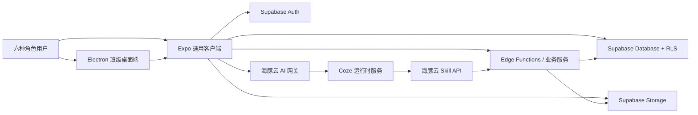

# 02｜架构与数据设计

## 1. 总体架构



设计原则：

- 一套 Expo 客户端按角色显示六种界面。
- Web、Android、iOS 共用业务代码；Electron 只封装 Web 并补充桌面能力。
- 普通读取可以通过 Supabase SDK 和 RLS 完成。
- 分值、币账、罚款、成绩发布、撤销等关键写操作必须经过数据库函数或 Edge Function。
- Coze 只能访问后端提供的受控 Skill API。

## 2. Monorepo 结构

```text
apps/client/
├── app/                       # Expo Router，只放路由组合
├── src/features/
│   ├── courseware/
│   ├── homework/
│   ├── grades/
│   ├── student-score/
│   ├── class-score/
│   ├── bank/
│   ├── fines/
│   ├── operations/
│   ├── ai-center/
│   └── daily-summary/
└── src/shared/

apps/desktop/                  # Electron 主进程、窗口和打包配置
packages/api-client/           # API 调用、错误映射、查询键
packages/auth/                 # 角色、会话、权限辅助函数
packages/domain/               # 业务类型和常量
packages/ui/                   # 跨端 UI 组件和主题
packages/validation/           # Zod 输入输出校验
supabase/functions/            # 关键写操作与 AI 网关
supabase/migrations/           # 只追加的数据库迁移
supabase/tests/                # RLS 与数据库函数测试
```

路由文件只负责装配，业务逻辑必须放在 `src/features` 或共享 package，防止六端页面复制逻辑。

## 3. 客户端分层

每个 feature 使用相同结构：

```text
feature-name/
├── api/          # 查询、mutation、DTO 映射
├── components/   # 该业务组件
├── screens/      # 可被路由组合的页面
├── hooks/        # 状态和交互逻辑
├── schemas/      # 输入校验，优先引用 shared validation
├── types.ts
└── __tests__/
```

约束：

- 页面不得直接拼接 SQL。
- 组件不得自行判断服务端权限；客户端权限只用于隐藏入口和改善体验。
- 服务器返回统一错误码，客户端集中映射为用户提示。
- 写操作成功后按查询键精确失效，不全局清空缓存。

## 4. 身份与授权模型

### 4.1 角色

```text
teacher | class_terminal | family | bank_operator | council | admin
```

一个用户可以拥有多个角色，通过当前角色和当前作用范围切换界面。例如教师同时是家长时，角色切换不创建第二个账号。

### 4.2 数据范围

- 教师：`teacher_class_assignments` 中关联的班级。
- 班级端：当前设备绑定的一个班级；写操作另需实际操作人授权。
- 家庭端：本人学生 ID 或 `household_students` 绑定学生。
- 银行端：银行角色授权的学校范围。
- 自治会端：`council_scopes` 授权的年级或班级范围。
- 管理端：学校范围；跨学校访问不在 MVP 中。

### 4.3 权限执行

权限必须执行两次：

1. 客户端根据角色隐藏不可用入口。
2. RLS、数据库函数或 Edge Function 根据登录用户重新校验。

客户端传入的 `actor_id`、`role`、`class_id` 不可信。服务端必须从 JWT 和授权表计算。

## 5. 核心数据模型

所有表使用 UUID 主键、`created_at timestamptz`，业务表根据需要增加 `updated_at`。删除优先采用状态字段，账务和审计表禁止硬删除。

### 5.1 身份与组织

| 表 | 关键字段 | 说明 |
| --- | --- | --- |
| `profiles` | `id`, `display_name`, `status` | 对应 Auth 用户 |
| `schools` | `id`, `name` | MVP 保留一所演示学校 |
| `classes` | `id`, `school_id`, `grade`, `name` | 班级 |
| `students` | `id`, `profile_id?`, `student_no`, `class_id` | 学生档案，可尚未绑定账号 |
| `role_assignments` | `user_id`, `role`, `scope_type`, `scope_id` | 用户角色与范围 |
| `teacher_class_assignments` | `teacher_id`, `class_id`, `subject` | 教师授课关系 |
| `households` | `id`, `name` | 家庭 |
| `household_members` | `household_id`, `user_id`, `member_type` | 家长或学生账号 |
| `household_students` | `household_id`, `student_id` | 家庭可查看的学生 |
| `class_device_bindings` | `device_id`, `class_id`, `status` | 班级公共设备绑定 |

### 5.2 课件与作业

| 表 | 关键字段 | 说明 |
| --- | --- | --- |
| `courseware_items` | `teacher_id`, `title`, `subject`, `storage_path`, `status` | 教师上传内容 |
| `courseware_targets` | `courseware_id`, `class_id`, `sent_at` | 发送目标班级 |
| `courseware_receipts` | `target_id`, `device_id`, `received_at`, `downloaded_at` | 班级接收状态 |
| `courseware_returns` | `class_id`, `teacher_id`, `storage_path`, `operator_id` | 班级回传资料 |
| `assignments` | `teacher_id`, `class_id`, `subject`, `title`, `content`, `due_at`, `status` | 作业 |
| `assignment_attachments` | `assignment_id`, `storage_path` | 作业附件 |
| `assignment_acknowledgements` | `assignment_id`, `student_id`, `state` | 已知晓或已完成 |

### 5.3 成绩

| 表 | 关键字段 | 说明 |
| --- | --- | --- |
| `assessments` | `teacher_id`, `class_id`, `subject`, `title`, `status`, `published_at` | 测验或考试 |
| `grade_records` | `assessment_id`, `student_id`, `score`, `comment` | 当前成绩 |
| `grade_revisions` | `grade_id`, `old_score`, `new_score`, `reason`, `actor_id` | 不可变修改历史 |

`score` 可使用 `numeric(7,2)`，但不得与学生分的整数分值字段共用。

### 5.4 学生分与班级分

| 表 | 关键字段 | 说明 |
| --- | --- | --- |
| `student_score_categories` | `id`, `name`, `default_delta`, `active` | 学生分项目 |
| `student_score_entries` | `student_id`, `class_id`, `delta`, `reason`, `actor_id`, `operation_id` | 不可变学生分流水 |
| `class_score_categories` | `id`, `name`, `default_delta`, `active` | 班级分项目 |
| `class_score_entries` | `class_id`, `delta`, `reason`, `evidence_path`, `actor_id`, `operation_id` | 不可变班级分流水 |
| `class_score_appeals` | `entry_id`, `requester_id`, `reason`, `status` | 简化更正申请 |

学生总分和班级总分由有效流水求和，可使用数据库 View 或物化汇总表优化。MVP 优先保证正确性，不在客户端维护权威总分。

### 5.5 海豚币与罚款

| 表 | 关键字段 | 说明 |
| --- | --- | --- |
| `dolphin_accounts` | `student_id`, `balance`, `version` | 当前余额和乐观锁版本 |
| `dolphin_transactions` | `account_id`, `delta`, `type`, `reason`, `actor_id`, `operation_id` | 不可变币账流水 |
| `fine_rules` | `code`, `name`, `max_amount`, `active` | 银行端管理的罚款规则 |
| `fine_orders` | `student_id`, `rule_id`, `amount`, `reason`, `status`, `teacher_id`, `transaction_id?` | 罚款单 |

余额更新和流水写入必须在同一数据库事务中完成。使用账户行锁或原子数据库函数，禁止客户端“先读余额再写余额”。

### 5.6 操作、撤销与 AI

| 表 | 关键字段 | 说明 |
| --- | --- | --- |
| `operations` | `id`, `kind`, `actor_id`, `target_type`, `target_id`, `idempotency_key`, `status`, `metadata` | 所有关键写操作索引 |
| `reversal_links` | `original_operation_id`, `reversal_operation_id`, `reason` | 原操作与反向操作关系 |
| `audit_events` | `actor_id`, `action`, `resource_type`, `resource_id`, `result`, `request_id` | 安全审计 |
| `ai_sessions` | `user_id`, `coze_conversation_ref`, `status` | AI 会话映射，不保存 Coze 密钥 |
| `ai_action_drafts` | `user_id`, `action_type`, `payload`, `expires_at`, `status` | 等待用户确认的写操作草稿 |

## 6. 撤销机制

### 6.1 统一流程

1. 查询有权限撤销的 `operations`。
2. 服务端锁定目标操作并检查当前状态。
3. 计算反向影响并返回预览。
4. 用户确认并提交撤销原因。
5. 在同一事务中新增反向业务流水、新 `operations` 和 `reversal_links`。
6. 原操作状态标记为 `reversed`，但原业务记录不删除。

### 6.2 并发与幂等

- `operations.idempotency_key` 建唯一索引。
- `reversal_links.original_operation_id` 对当前有效撤销建立唯一约束。
- 数据库事务锁定原操作，防止两个人同时撤销。
- 重新执行相同请求时返回第一次结果，不产生第二条流水。
- 恢复操作通过撤销“反向操作”完成，形成完整链路。

## 7. 文件安全

- Storage bucket 默认私有。
- 数据库存储 `storage_path`，不长期保存公开 URL。
- 下载前由服务端或 RLS 校验用户与班级关系，再生成短期签名 URL。
- 限制扩展名、MIME、单文件大小和总配额。
- 上传文件名不作为存储路径，使用 UUID；原文件名单独显示并转义。
- 课件撤回只改变可见状态，是否清理对象由异步任务处理。

## 8. 可观测性

- 每次请求生成 `request_id`，关键写操作另有 `operation_id`。
- 日志记录错误码、角色、资源类型和耗时，不记录 token、成绩内容或完整学生隐私。
- AI 调用额外记录 provider、模型标识、延迟、结果类型和失败原因，不记录服务密钥。
- 构建版本展示 `app_version` 和 Git commit SHA，便于演示现场定位。

