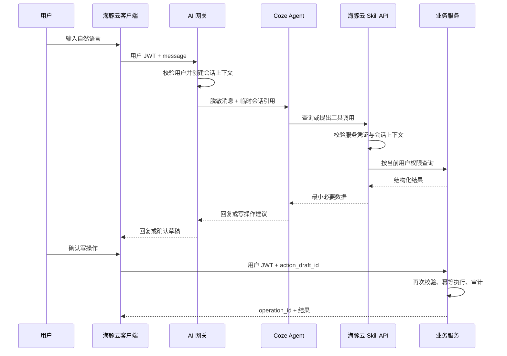

# 03｜API 与 Coze 接入

## 1. 接口原则

- 客户端使用 Supabase Auth JWT 访问海豚云服务。
- 普通列表读取可以经 Supabase SDK + RLS；关键写操作统一经 Edge Functions 或数据库 RPC。
- API 使用 JSON，字段采用 `snake_case`，时间使用 ISO 8601 UTC。
- 所有写操作接受 `Idempotency-Key` 请求头。
- 所有响应携带 `request_id`；关键写操作同时返回 `operation_id`。
- API 的输入和输出使用共享 Zod Schema 校验，并生成 TypeScript 类型。

## 2. 统一响应

### 成功

```json
{
  "data": {},
  "request_id": "uuid",
  "operation_id": "uuid"
}
```

查询响应可以没有 `operation_id`。

### 失败

```json
{
  "error": {
    "code": "INSUFFICIENT_BALANCE",
    "message": "海豚币余额不足",
    "details": {}
  },
  "request_id": "uuid"
}
```

前端根据 `error.code` 映射提示，不解析服务端自然语言来决定逻辑。

### 建议错误码

| 错误码 | HTTP | 含义 |
| --- | ---: | --- |
| `UNAUTHENTICATED` | 401 | 未登录或会话失效 |
| `FORBIDDEN` | 403 | 角色或数据范围不允许 |
| `NOT_FOUND` | 404 | 资源不存在或不可见 |
| `VALIDATION_ERROR` | 422 | 输入不符合业务规则 |
| `CONFLICT` | 409 | 状态已变化 |
| `DUPLICATE_REQUEST` | 409 | 幂等请求已处理 |
| `INSUFFICIENT_BALANCE` | 422 | 海豚币余额不足 |
| `ALREADY_REVERSED` | 409 | 目标操作已经撤销 |
| `AI_UNAVAILABLE` | 503 | Coze 暂不可用，仅影响 AI 中心 |
| `INTERNAL_ERROR` | 500 | 未预期服务端错误 |

## 3. MVP API 清单

以下路径是逻辑契约，可实现为 `/functions/v1/...` Edge Functions。读取端点也可由受 RLS 保护的表或 View 提供，但客户端调用层必须保持相同 DTO。

### 3.1 会话与角色

| 方法与路径 | 说明 |
| --- | --- |
| `GET /me` | 当前档案、可用角色和范围 |
| `POST /me/active-context` | 切换当前角色与班级／家庭范围 |
| `GET /me/today-summary` | 当前角色今日摘要 |

### 3.2 课件

| 方法与路径 | 说明 |
| --- | --- |
| `POST /courseware/upload-intent` | 获取受限上传地址 |
| `POST /courseware` | 创建课件并关联已上传对象 |
| `POST /courseware/{id}/send` | 发送至班级 |
| `GET /classes/{id}/courseware` | 查询班级课件 |
| `POST /courseware-targets/{id}/receipt` | 记录接收或下载 |
| `POST /courseware/{id}/withdraw` | 撤回发送 |
| `POST /courseware/returns` | 班级回传资料 |

### 3.3 学生分与排行

| 方法与路径 | 说明 |
| --- | --- |
| `POST /student-scores` | 单人加减分 |
| `POST /student-scores/batch` | 批量加减分 |
| `GET /students/{id}/scores` | 个人流水与总分 |
| `GET /classes/{id}/student-ranking?period=week` | 班内排行 |

`delta` 必须为非零整数；服务端从当前用户权限计算可操作班级。

### 3.4 班级分

| 方法与路径 | 说明 |
| --- | --- |
| `POST /class-scores` | 自治会加减班级分 |
| `GET /classes/{id}/class-scores` | 本班总分与流水 |
| `POST /class-score-appeals` | 提交更正申请 |
| `PATCH /class-score-appeals/{id}` | 管理端处理申请 |

### 3.5 作业与成绩

| 方法与路径 | 说明 |
| --- | --- |
| `POST /assignments` | 创建作业草稿 |
| `POST /assignments/{id}/publish` | 发布作业 |
| `PATCH /assignments/{id}` | 修改未结束作业 |
| `POST /assignments/{id}/acknowledge` | 家庭端标记状态 |
| `POST /assessments` | 创建测验或考试 |
| `PUT /assessments/{id}/grades` | 批量保存成绩草稿 |
| `POST /assessments/{id}/publish` | 发布成绩 |
| `PATCH /grades/{id}` | 修正成绩并写修订记录 |
| `GET /students/{id}/grades` | 查询授权学生成绩 |

新增成绩单契约使用以下逻辑接口；旧 `assessments` 单成绩字段接口在迁移期间保持兼容：

| 方法与路径 | 说明 |
| --- | --- |
| `PUT /grade-report-sheets/{id?}` | 原子保存填写表格或 CSV/XLSX 规范化 DTO 草稿 |
| `POST /grade-report-sheets/{id}/publish` | 一次发布整张成绩单 |
| `PATCH /grade-report-values/{id}` | 修订已发布的单个值并写不可变历史 |
| `GET /students/{id}/grade-report-sheets` | 家庭端只返回绑定学生本人的已发布成绩单和值 |

数据库实现对应 `save_grade_report_sheet_draft`、`publish_grade_report_sheet`、`revise_grade_report_value` 和 `list_published_grade_report_sheets_for_student` RPC。RPC 不接收 `actor_id` 或角色，身份只来自当前 Supabase JWT。上传解析层必须先把 CSV 或 XLSX 二维单元格规范化为同一个整表 DTO；任一列名、学生、数值或满分校验失败时，RPC 不写入任何数据。

### 3.6 海豚币与罚款

| 方法与路径 | 说明 |
| --- | --- |
| `GET /students/{id}/dolphin-account` | 余额与近期流水 |
| `POST /dolphin-transactions` | 银行端发放、扣除或调整 |
| `POST /fine-orders` | 教师发起罚款 |
| `POST /fine-orders/{id}/process` | 银行端处理待处理罚款 |
| `GET /fine-orders` | 按权限查询罚款单 |
| `GET /dolphin-transactions` | 按权限查询币账流水 |

### 3.7 操作与撤销

| 方法与路径 | 说明 |
| --- | --- |
| `GET /operations` | 按权限和筛选条件查询操作 |
| `POST /operations/{id}/reversal-preview` | 返回撤销影响预览 |
| `POST /operations/{id}/reverse` | 创建反向操作 |
| `GET /operations/{id}` | 操作、反向链和审计详情 |

## 4. 写操作契约示例

### 学生加分

请求：

```json
{
  "student_id": "uuid",
  "category_id": "uuid",
  "delta": 3,
  "reason": "主动回答问题"
}
```

响应：

```json
{
  "data": {
    "entry_id": "uuid",
    "student_id": "uuid",
    "new_total": 28
  },
  "request_id": "uuid",
  "operation_id": "uuid"
}
```

### 撤销预览

```json
{
  "data": {
    "original_operation_id": "uuid",
    "kind": "student_score.add",
    "current_state": "active",
    "effect": {
      "student_id": "uuid",
      "current_total": 28,
      "after_total": 25
    },
    "can_reverse": true,
    "expires_at": "2026-08-02T12:00:00Z"
  },
  "request_id": "uuid"
}
```

最终撤销请求必须携带预览返回的短期确认 token 或版本号，避免用户确认前状态已经变化。

## 5. Coze 的唯一定位

Coze 是海豚云运行时的外部 AI 服务，不是开发平台。

### 禁止事项

- 不使用 Coze 或 Coze CLI 创建项目、生成代码、修改代码、执行测试、修复缺陷或构建安装包。
- 不把 GitHub 仓库、服务角色密钥、数据库直连地址或用户 JWT 提供给 Coze。
- 不让 Coze 决定最终权限、不让 Coze 直接执行未经确认的写操作。
- 不因 Coze 故障阻塞普通功能。

### 允许事项

- 应用运行时将用户对话发送给海豚云 AI 网关。
- AI 网关调用 Coze Agent 获取意图、回复或工具调用建议。
- Coze 通过受控海豚云 Skill 查询授权数据或生成写操作草稿。
- 用户在海豚云客户端确认后，由海豚云服务执行真实写操作。

## 6. AI 运行时架构



关键点：Coze 返回的是“建议”或“草稿”，真正的写操作由海豚云服务根据已登录用户执行。

## 7. AI 接口

| 方法与路径 | 说明 |
| --- | --- |
| `POST /ai/chat` | 发送消息，返回文本、查询卡片或写操作草稿 |
| `GET /ai/sessions/{id}/messages` | 查询当前用户的 AI 消息 |
| `POST /ai/action-drafts/{id}/confirm` | 用户确认后执行草稿 |
| `POST /ai/action-drafts/{id}/cancel` | 取消草稿 |
| `POST /skills/query` | Coze 调用的受控只读工具入口 |
| `POST /skills/propose-action` | Coze 提出写操作草稿，不执行业务 |

`/skills/*` 不能只凭请求体中的用户 ID 授权。AI 网关为每次对话签发短期、单用途、绑定用户和允许工具集合的上下文 token；Skill API 校验后再解析真实用户范围。

## 8. AI 返回类型

```ts
type AiResponse =
  | { type: 'text'; text: string }
  | { type: 'data_card'; card: DataCard }
  | { type: 'action_draft'; draft_id: string; preview: ActionPreview }
  | { type: 'error'; code: string; fallback_message: string };
```

客户端只渲染白名单卡片类型，不执行 Coze 返回的任意脚本、URL 或组件代码。

## 9. Skill 最小能力

| 工具名 | 类型 | 角色范围 |
| --- | --- | --- |
| `get_today_summary` | 查询 | 当前用户 |
| `list_courseware` | 查询 | 教师、班级 |
| `list_assignments` | 查询 | 教师、班级、家庭 |
| `get_student_score` | 查询 | 教师、班级、对应家庭 |
| `get_class_score` | 查询 | 教师、班级、自治会 |
| `get_grades` | 查询 | 教师、对应家庭 |
| `get_dolphin_account` | 查询 | 教师、对应家庭、银行 |
| `propose_student_score` | 草稿 | 教师、授权班级操作者 |
| `propose_class_score` | 草稿 | 自治会 |
| `propose_assignment_publish` | 草稿 | 教师 |
| `propose_fine` | 草稿 | 教师 |
| `propose_transaction_reversal` | 草稿 | 银行、管理员 |

黑客松版本优先实现查询和 2—3 个有代表性的写操作草稿，不为演示数量牺牲权限安全。

## 10. 环境变量

### 客户端可公开

```text
EXPO_PUBLIC_SUPABASE_URL
EXPO_PUBLIC_SUPABASE_ANON_KEY
EXPO_PUBLIC_APP_ENV
EXPO_PUBLIC_AI_GATEWAY_FUNCTION
```

### 仅服务端保存

```text
SUPABASE_SERVICE_ROLE_KEY
COZE_API_BASE_URL
COZE_BOT_ID
COZE_API_TOKEN
SUPABASE_JWT_SECRET
AI_SKILL_ENDPOINT
AI_GATEWAY_TIMEOUT_MS
COZE_SKILL_SHARED_SECRET
AI_CONTEXT_SIGNING_SECRET
```

服务端密钥通过部署平台 Secret 管理；禁止写入 `.env.example` 的真实值。PR 日志中只检查变量是否存在，不输出内容。

当前 `ai-gateway` Edge Function 使用 `SUPABASE_URL`、`SUPABASE_ANON_KEY` 和调用者 JWT 访问数据，刻意不使用 service role 绕过 RLS。`SUPABASE_JWT_SECRET` 只在服务端签发 60 秒、单用途 Skill 上下文 JWT；`AI_SKILL_ENDPOINT` 指向受控 `/skills/query`。部署前执行 `pnpm build:edge`，生成函数目录内不依赖 workspace 源码的单文件 bundle。

## 11. 降级与超时

- Coze 调用设置明确的连接和总超时。
- 查询失败时显示“AI 暂不可用”，并提供对应普通页面入口。
- 已创建但未确认的草稿在短时间后过期。
- Coze 返回不合法结构时拒绝执行并记录错误码。
- AI 重试不得复用新的幂等键执行同一写操作。
- 演示现场准备关闭 Coze 后的普通功能备用路径和录屏。

## 12. AI 接入验收

- 客户端包和 Web 资源中搜索不到 Coze token。
- Coze 无法通过 Skill 查询当前用户权限外的数据。
- 写操作必须先返回预览，未确认时数据库不变化。
- 确认时服务端再次检查权限和数据版本。
- 重复确认同一草稿只产生一条业务流水。
- Coze 超时或返回错误时，普通功能、导航和账号会话不受影响。

