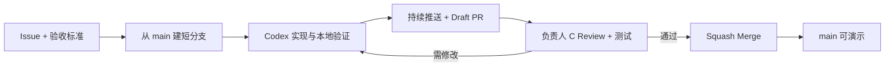

# 04｜GitHub 协作规范

## 1. 协作模型

采用受保护的 `main` 加短生命周期分支：



不设置长期 `develop` 分支。三人规模下，长期双主干会增加同步和发布成本。

## 2. GitHub 配置

### `main` 分支保护

必须开启：

- Require a pull request before merging。
- Require at least 1 approving review。
- Require review from Code Owners。
- Dismiss stale approvals when new commits are pushed。
- Require status checks to pass。
- Require conversation resolution before merging。
- Block force pushes and branch deletion。
- Include administrators，演示前也不得绕过门禁。

推荐只允许 Squash Merge，关闭普通 Merge Commit 和 Rebase Merge，使一个 Issue 在 `main` 中对应一个提交。

### 必需检查

```text
lint
typecheck
unit-test
database-test
web-export
secret-scan
```

桌面和安装包完整构建可以在合并到 `main` 或 Release Candidate 标签时运行，避免每个 PR 等待过久。

## 3. GitHub Project

状态列：

```text
Backlog → Ready → In Progress → In Review → QA → Done
```

字段：

- Owner：A / B / C。
- Area：Platform / Teaching / Score / Bank / AI / Build / Docs。
- Priority：P0 / P1 / P2。
- Size：S / M / L。
- Milestone：M0 Foundation / M1 Core / M2 AI / RC1。

WIP 限制：

- A、B 各自最多同时 1 个 `In Progress` 功能 Issue。
- C 最多同时处理 2 个 Review/QA 项目。
- 被阻塞任务回到 `Ready` 或标记 `blocked`，不要长期占用 WIP。

## 4. Issue 规则

开始编码前必须有 Issue。Issue 至少包含：

- 背景和用户价值。
- 明确的 In Scope / Out of Scope。
- 可验证的验收标准。
- 受影响角色、数据和安全点。
- UI、API、迁移或文档依赖。
- 测试要求。

如果预计修改超过约 500 行有效代码、跨越两个业务域或超过两天，应拆分 Issue。数据库迁移和 API 契约可以作为前置 Issue。

## 5. 分支命名

```text
feat/<issue>-<short-name>
fix/<issue>-<short-name>
test/<issue>-<short-name>
docs/<issue>-<short-name>
chore/<issue>-<short-name>
release/<version>
```

示例：

```text
feat/42-student-ranking
fix/87-reversal-race
test/91-bank-rls
```

## 6. 标准 Git 流程

### 创建任务分支

```bash
git fetch origin
git switch main
git pull --ff-only origin main
git switch -c feat/42-student-ranking
```

### 开发中检查

```bash
git status --short
git diff
pnpm lint
pnpm typecheck
pnpm test
```

### 提交和推送

```bash
git add <明确文件>
git diff --cached
git commit -m "feat(score): add weekly class ranking"
git push -u origin feat/42-student-ranking
```

禁止使用 `git add .` 盲目提交未知文件。Codex 执行 commit 或 push 前必须获得当前开发者明确指令。

### 同步主分支

分支尚未推送时可以：

```bash
git fetch origin
git rebase origin/main
```

分支已经推送或其他人使用后，使用：

```bash
git fetch origin
git merge origin/main
```

不得改写他人已使用分支的历史，不得使用普通 `--force`。确需修复自己无人共享的分支历史时，先说明原因并只使用 `--force-with-lease`。

## 7. 提交规范

格式：

```text
<type>(<scope>): <summary>
```

类型：

- `feat`：新功能。
- `fix`：缺陷修复。
- `test`：测试。
- `refactor`：不改变功能的重构。
- `docs`：文档。
- `build`：构建与依赖。
- `ci`：GitHub Actions。
- `chore`：其他维护。

常用 scope：`auth`、`courseware`、`score`、`grade`、`bank`、`reversal`、`ai`、`desktop`、`db`。

提交应保持可解释、可测试。不要把格式化、依赖升级、数据库迁移和多个功能混在同一提交。

## 8. Pull Request 规则

- 开始工作后尽早创建 Draft PR，让依赖和接口变化可见。
- 首个有效 checkpoint 推送后立即创建 Draft PR；后续每个可验证步骤或最长 90 分钟推送一次，供 C 持续测试。
- 每次请求 QA 时，在 PR 评论 `[READY_FOR_QA] <commit SHA>`，不得只写“最新代码”。
- 标题使用与提交相同的 Conventional Commit 格式。
- 关联并自动关闭 Issue，例如 `Closes #42`。
- 使用 PR 模板填写变更、验证、截图、迁移和风险。
- UI 变化提供目标端截图或短视频。
- API 变化同步契约、Schema 和测试。
- 数据库变化说明升级、回退和种子数据影响。
- PR 变更过大时先拆分，不让 Reviewer 在巨型 diff 中找问题。

## 9. Review 与修复职责

### A、B 的功能 PR

负责人 C 必须：

1. 先检查 Issue 验收标准和文档一致性。
2. 阅读 diff，重点检查权限、不可变流水、幂等和错误处理。
3. 拉取 PR 分支运行测试和目标角色操作路径。
4. 在对应代码行提出可复现的审查意见。
5. 将 PR 标记为通过、需修改或阻塞。

C 的每次测试评论必须包含实际 commit SHA。A/B 新推送后，旧 SHA 的通过结论仍作为历史证据，但不能自动代表新 SHA 已通过。

正常业务缺陷由原作者修复，C 复测并重新 Review。

### C 负责的修复

C 可以独立创建以下修复 PR：

- 测试基础设施、CI、构建和打包问题。
- 多模块集成缺陷。
- 演示环境中复现的阻塞性问题。
- A/B 明确移交的缺陷。

C 的任何修复 PR 必须由 A 或 B Review 并批准；C 不得自审自合并。

### 严重度

| 等级 | 定义 | 处理 |
| --- | --- | --- |
| P0 | 越权、密钥泄露、余额错误、数据损坏、无法构建 | 禁止合并或发布，立即修复 |
| P1 | 核心验收流程失败、崩溃、撤销错误 | 当前里程碑必须修复 |
| P2 | 非核心错误、体验问题、可绕过的问题 | 记录并排期 |

## 10. 冲突处理

- 冲突由当前分支作者解决，必要时邀请冲突文件的 Code Owner 配对。
- 解决前分别阅读 `ours` 和 `theirs` 的意图，不以“让编译通过”为唯一目标。
- 数据库迁移出现语义冲突时，不修改已经合并迁移；新增修正迁移。
- 锁文件冲突先合并 `package.json` 意图，再用统一 pnpm 版本重新生成。
- 解决后重新运行完整受影响测试，并在 PR 说明冲突范围。

## 11. 数据库迁移协作

- 文件名格式：`YYYYMMDDHHMM_<issue>_<description>.sql`。
- 每个迁移只表达一个可回顾的结构变化。
- 已合并迁移永不编辑；修复必须追加新迁移。
- 迁移必须包含权限、索引和必要注释，不能只建表不写 RLS。
- 在 PR 中写清前向迁移、回退方式和数据兼容性。
- A、B 在增加迁移前在 Project 中标记，避免同时修改同一实体。
- C 在干净数据库和已有种子数据库各执行一次迁移验证。

## 12. 版本与发布

- `0.1.0`：黑客松 MVP。
- `0.1.0-rc.1`：第一候选版本。
- 标签由 C 从通过 QA 的 `main` commit 创建。
- 构建物必须能追溯到 Git tag 和 commit SHA。
- 发布说明列出功能、已知问题、迁移和 Web 构建／部署状态。
